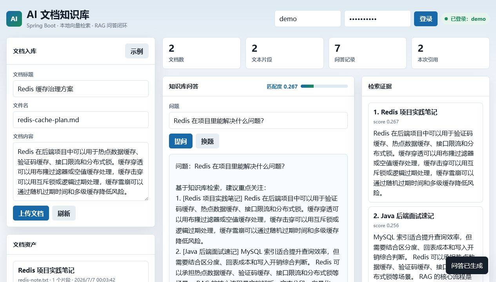

# AI 文档知识库

面向 Java 后端实习投递的 RAG 风格知识库项目。项目支持用户登录、文档入库、文本分块、本地向量检索、知识库问答、引用片段展示、问答历史、重建索引和文档删除。默认使用 H2 文件数据库，下载后可以直接运行，也预留了迁移到 MySQL、Redis、Qdrant/Milvus 和真实大模型 API 的空间。



## 技术栈

- Java 17
- Spring Boot 3.3
- Spring Web / Validation / JDBC
- H2 本地文件数据库，兼容 MySQL 模式
- HMAC Token 鉴权
- 本地轻量向量检索，支持替换为真实 Embedding + 向量数据库
- JUnit 5 / Spring Boot Test
- Docker / Docker Compose

## 核心功能

- 登录注册：密码加盐哈希存储，接口使用 Bearer Token 鉴权。
- 文档管理：新增文档、文档列表、删除文档、查看分块。
- RAG 问答：问题向量化、相似片段检索、引用片段返回、规则化答案生成。
- 索引维护：支持对单篇文档重新分块和重建向量索引。
- 仪表盘：展示文档数、文本片段数、问答记录数和最近问题。
- 可视化页面：打开 jar 后直接访问 `http://localhost:8081/` 演示完整链路。

## 本地运行

```powershell
mvn test
mvn -DskipTests package
java -jar target/ai-knowledge-base-0.1.0.jar
```

也可以使用脚本：

```powershell
powershell -ExecutionPolicy Bypass -File .\verify.ps1
powershell -ExecutionPolicy Bypass -File .\start-dev.ps1
```

访问地址：

```text
http://localhost:8081/
```

测试账号：

```text
username: demo
password: demo123456
```

## 配置项

```powershell
$env:APP_TOKEN_SECRET="replace-with-a-long-random-secret"
$env:H2_CONSOLE_ENABLED="false"
```

默认开发库：

```text
jdbc:h2:file:./data/ai-knowledge-base
```

## 接口说明

| 方法 | 地址 | 说明 |
| --- | --- | --- |
| GET | `/api/health` | 健康检查 |
| POST | `/api/auth/register` | 注册并返回 token |
| POST | `/api/auth/login` | 登录并返回 token |
| POST | `/api/documents` | 新增文档 |
| GET | `/api/documents` | 文档列表 |
| GET | `/api/documents/{id}/chunks` | 查看文档分块 |
| POST | `/api/documents/{id}/reindex` | 重建文档索引 |
| DELETE | `/api/documents/{id}` | 删除文档 |
| POST | `/api/ask` | 知识库问答 |
| GET | `/api/conversations` | 问答历史 |
| GET | `/api/dashboard` | 仪表盘统计 |

登录示例：

```powershell
curl -X POST http://localhost:8081/api/auth/login `
  -H "Content-Type: application/json" `
  -d "{\"username\":\"demo\",\"password\":\"demo123456\"}"
```

问答示例：

```powershell
curl -X POST http://localhost:8081/api/ask `
  -H "Content-Type: application/json" `
  -H "Authorization: Bearer <token>" `
  -d "{\"question\":\"Redis 在项目里能解决什么问题？\",\"topK\":3}"
```

## 代码质量改进

本次已补齐：

- 统一异常返回，前端和测试都能稳定读取错误信息。
- Token payload 结构校验，密钥支持环境变量覆盖。
- 文档文件名清洗，避免展示脏路径。
- 段落优先分块和重建索引接口。
- 文档、分块、问答历史常用查询索引。
- 集成测试覆盖核心业务链路。

详细记录见 [docs/CODE_REVIEW.md](docs/CODE_REVIEW.md)。

## 面试亮点

- RAG 工程链路：文档清洗、分块、向量化、检索、引用、答案生成。
- 索引维护能力：支持重建索引和查看分块，便于解释线上知识库如何迭代。
- 安全基础：密码加盐哈希、HMAC Token、密钥环境变量化。
- 工程完整度：统一异常、参数校验、自动化测试、Docker 部署、可视化前端。
- 可扩展方向：Embedding API、Qdrant/Milvus、PDF/Word 解析、Redis 缓存、多租户权限。

完整话术见 [docs/INTERVIEW_NOTES.md](docs/INTERVIEW_NOTES.md)。

## 测试与部署

```powershell
mvn test
mvn -DskipTests package
docker build -t ai-knowledge-base:0.1.0 .
```

部署说明见 [docs/DEPLOYMENT.md](docs/DEPLOYMENT.md)。
